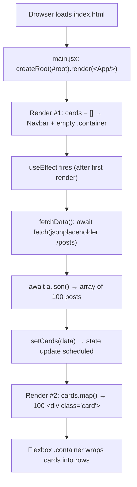

# Lecture 113 — Solution: Display the Cards

## Overview

This lecture is the **official solution walkthrough** for the exercise set in Lecture 111. The challenge: hit a real REST API — [JSONPlaceholder](https://jsonplaceholder.typicode.com/posts) — pull down 100 blog posts, and render **every single one of them as a card** inside a container on the page.

This tiny project is a big milestone, because it forces four core React skills to work together for the first time:

| Skill | Where it shows up |
|---|---|
| **State** (`useState`) | Holding the fetched posts in memory |
| **Side effects** (`useEffect`) | Running the fetch exactly once, on mount |
| **Async data fetching** (`fetch` + `async/await`) | Talking to the JSONPlaceholder API |
| **List rendering** (`.map()` + `key`) | Turning an array of 100 objects into 100 cards |

It also reinforces **component composition** — the page is assembled from a reusable `<Navbar />` component plus the card grid — and shows a minimal **flexbox card layout** in plain CSS.

---

## The Challenge

Here is the original assignment, exactly as it was given:

> You have to use an api and display the data in the form of a card under a container. All the data points returned by the API should be converted to a card
> Use this API: https://jsonplaceholder.typicode.com/posts
>
> Hint:
> Create a state for the data which will be fetched using the Json Placeholder API
> Inside useEffect, use fetch to populate that state and then use map to render the cards from that state

The hint literally spells out the three-step recipe this solution follows:

1. **State** for the data.
2. **`useEffect` + `fetch`** to populate that state.
3. **`.map()`** to render a card per item.

---

## Project Structure

```
Lec-113 Solution Display the cards/
├── index.html              # Single HTML page with the #root div
├── package.json            # Vite + React 18 project manifest
├── Readme.md               # These notes (originally: the assignment text)
└── src/
    ├── main.jsx            # Entry point — mounts <App /> into #root
    ├── App.jsx             # ⭐ The solution: state + effect + fetch + map
    ├── App.css             # (empty in this project)
    ├── index.css           # All styles: reset, navbar, container, card
    └── components/
        └── Navbar.jsx      # Simple presentational navbar component
```

> Note: even though `App.jsx` imports `./App.css`, that file is **empty** here — every style actually lives in `src/index.css`, which is imported once in `main.jsx` and therefore applies globally.

---

## Concept Deep-Dives

### 1. The `useState` + `useEffect` + `fetch` pattern

This is *the* canonical pattern for loading data into a React component. From `App.jsx`, verbatim:

```jsx
const [cards, setCards] = useState([])

const fetchData = async () => {
  let a = await fetch("https://jsonplaceholder.typicode.com/posts")
  let data = await a.json()
  setCards(data)
  console.log(data)
}

useEffect(() => {
  fetchData()
}, [])
```

Why each piece exists:

- **`useState([])`** — `cards` starts as an **empty array**. This is deliberate: on the very first render the data hasn't arrived yet, and `[].map(...)` safely renders nothing. If we started with `null` or `undefined`, calling `.map()` on it would crash the app.
- **`useEffect(..., [])`** — React components must keep their render phase *pure*; network requests are **side effects**, so they belong in `useEffect`. The empty dependency array `[]` means "run this effect **once, after the first render**" — the React equivalent of "on page load".
- **`fetch` + `.json()`** — `fetch()` returns a `Response` object, not the data itself. `a.json()` parses the response body into a JavaScript array of 100 post objects. Both operations are asynchronous, hence the two `await`s.
- **`setCards(data)`** — this is the moment the UI comes alive. Calling the state setter tells React "the data changed — re-render me."
- **`console.log(data)`** — a debugging aid left in by the instructor so you can inspect the API's shape in DevTools. Each object looks like:

```json
{
  "userId": 1,
  "id": 1,
  "title": "sunt aut facere repellat provident occaecati excepturi optio reprehenderit",
  "body": "quia et suscipit\nsuscipit recusandae consequuntur expedita et cum\n..."
}
```

### 2. Why an `async` function *inside* (well, alongside) `useEffect`?

You cannot write `useEffect(async () => { ... }, [])`. React expects the effect callback to return either nothing or a **cleanup function** — but an `async` function always returns a **Promise**, which React would misinterpret. The standard workaround is exactly what this solution does: define a separate `async` function (`fetchData`) and **call it synchronously from inside the effect**:

```jsx
useEffect(() => {
  fetchData()
}, [])
```

Here `fetchData` is declared in the component body and invoked by the effect. (A common variant declares the async function *inside* the effect callback itself — same idea, slightly tighter scoping.)

### 3. `.map()` with the `key` prop

To turn an array of data into an array of JSX, use `.map()`. Verbatim from the render:

```jsx
{cards.map((card)=>{
  return <div key={card.id} className="card">
    <h1>{card.title}</h1>
    <p>{card.body}</p>
    <span>By: UserId: {card.userId} </span>
  </div>

})}
```

- Each post object becomes one `<div className="card">`.
- **`key={card.id}`** gives React a stable identity for every card. Keys let React's reconciler match old and new list items efficiently when the list changes; without them React falls back to index-based matching and logs a warning. The API's own `id` field is the perfect key — unique and stable.
- The curly braces `{ ... }` embed the resulting array of JSX elements directly into the container `<div>` — React happily renders arrays of elements.

### 4. Component composition — `Navbar`

The page is *composed* from smaller pieces. `App` doesn't contain navbar markup; it just drops in the component:

```jsx
import Navbar from './components/Navbar'
```

```jsx
<Navbar/>
```

`Navbar.jsx` itself is a pure **presentational component** — no props, no state, just markup (full source in the walkthrough below). This separation keeps `App.jsx` focused on data logic and makes the navbar reusable in any future page.

### 5. The card styling approach — plain global CSS with flexbox

No CSS frameworks, no inline styles, no CSS modules — just classic class-based CSS in `src/index.css`. The layout heart of the solution, verbatim:

```css
.card{
  border: 2px solid black;
  max-width: 23vw;
}

.container{
  display: flex;
  gap: 34px;
  flex-wrap: wrap;
}
```

- **`.container`** is a **flexbox** row. `flex-wrap: wrap` lets cards flow onto new lines when a row is full, and `gap: 34px` spaces them apart both horizontally and vertically — no margin hacks needed.
- **`.card`** gets a simple `2px solid black` border and `max-width: 23vw` (23% of the viewport width). Since 4 × 23vw + 3 gaps ≈ full width, you get roughly **four cards per row** on a typical screen, wrapping responsively as the window shrinks.

The rest of `index.css` is a universal reset plus navbar styling:

```css
*{
  margin: 0;
  padding: 0;
}
nav, ul{
  display: flex;
  gap: 14px;
  padding: 12px 3px;
  background-color: rgb(46, 46, 44);
  margin-bottom: 9px;
  color: white;
}

li{
  list-style: none;
  
}
```

The `* { margin: 0; padding: 0 }` reset kills browser default spacing; the navbar uses the same flexbox-with-gap trick to lay its links out in a row on a dark strip.

---

## Full Code Walkthrough

### `src/App.jsx` — the whole solution, step by step

```jsx
import { useState, useEffect } from 'react'
import Navbar from './components/Navbar'
import './App.css'

function App() {
  const [cards, setCards] = useState([])

  const fetchData = async () => {
    let a = await fetch("https://jsonplaceholder.typicode.com/posts")
    let data = await a.json()
    setCards(data)
    console.log(data)
  }

  useEffect(() => {
    fetchData()
  }, [])


  return (
    <>
    <Navbar/> 
      <div className="container">
       {cards.map((card)=>{
        return <div key={card.id} className="card">
          <h1>{card.title}</h1>
          <p>{card.body}</p>
          <span>By: UserId: {card.userId} </span>
        </div>

       })}
        
      </div>

    </>
  )
}

export default App
```

**Step 1 — Imports.** `useState` and `useEffect` come from React; `Navbar` is our own component; `App.css` is imported for styling (empty here, but the import is the conventional slot for component-level styles).

**Step 2 — State declaration.** `const [cards, setCards] = useState([])` creates the `cards` state variable (initially `[]`) and its setter. `cards` will eventually hold the array of 100 post objects.

**Step 3 — The fetch function.** `fetchData` is an `async` arrow function: `await fetch(...)` gets the HTTP response into `a`, `await a.json()` parses the JSON body into `data`, `setCards(data)` stores it in state, and `console.log(data)` echoes it to the console for inspection.

**Step 4 — The effect.** `useEffect(() => { fetchData() }, [])` calls `fetchData` **once after the first render** (empty dependency array). This is what kicks off the network request when the page loads.

**Step 5 — The render loop.** The JSX returns a fragment (`<>...</>`) containing `<Navbar/>` on top and a `.container` div below. Inside the container, `cards.map(...)` produces one `.card` div per post, each keyed by `card.id` and showing the post's `title` (as an `<h1>`), `body` (as a `<p>`), and `userId` (in a `<span>`).

**The two-render story.** Render #1: `cards` is `[]`, so the container is empty — you see just the navbar. The effect fires, the fetch resolves, `setCards(data)` runs. Render #2: `cards` has 100 items, and 100 cards appear.

### `src/components/Navbar.jsx`

```jsx
import React from 'react'

const Navbar = () => {
  return (
    <nav>
        <ul>
            <li>Home</li>
            <li>About</li>
            <li>Contact Us</li>
        </ul>
    </nav>
  )
}

export default Navbar
```

A stateless functional component: it takes no props, holds no state, and simply returns a `<nav>` with three list items. The `nav, ul` flexbox rules in `index.css` turn this into the dark horizontal bar at the top of the page. Defined once, `export default`-ed, and imported wherever needed — the essence of component reuse.

### `src/main.jsx` — the entry point

```jsx
import React from 'react'
import ReactDOM from 'react-dom/client'
import App from './App.jsx'
import './index.css'

ReactDOM.createRoot(document.getElementById('root')).render(
  <React.StrictMode>
    <App />
  </React.StrictMode>,
)
```

`main.jsx` grabs the `#root` div from `index.html`, creates a React root, and renders `<App />` inside `<React.StrictMode>`. Note that `index.css` (where all the actual styles live) is imported here, so it applies globally. StrictMode has one visible consequence in development: **effects run twice on mount**, so you'll see the fetch fire (and `console.log` print) two times — that's intentional dev-only behavior, not a bug, and it disappears in production builds.

### `index.html`

```html
<!doctype html>
<html lang="en">
  <head>
    <meta charset="UTF-8" />
    <link rel="icon" type="image/svg+xml" href="/vite.svg" />
    <meta name="viewport" content="width=device-width, initial-scale=1.0" />
    <title>Vite + React</title>
  </head>
  <body>
    <div id="root"></div>
    <script type="module" src="/src/main.jsx"></script>
  </body>
</html>
```

The standard Vite shell: one empty `<div id="root">` and a module script pointing at `main.jsx`. Everything you see on screen is injected into that div by React.

---

## How It All Fits Together — The Data Flow



In words:

1. **Mount** — the browser loads `index.html`; `main.jsx` mounts `<App />` into `#root`.
2. **First render** — `cards` is `[]`, so `cards.map()` returns nothing. The user briefly sees only the navbar and an empty container.
3. **Effect** — after that render commits, React runs the `useEffect` callback, which calls `fetchData()`.
4. **Fetch** — the browser requests `https://jsonplaceholder.typicode.com/posts`; the response is parsed into an array of 100 objects.
5. **State update** — `setCards(data)` replaces the empty array. React sees the state change and schedules a re-render.
6. **Re-render** — this time `cards.map()` yields 100 keyed card elements, which React commits to the DOM.
7. **Cards on screen** — CSS flexbox lays them out in wrapping rows, four-ish per line.

The key mental model: **UI = f(state)**. You never manually add cards to the page — you update the *state*, and React recomputes the UI from it.

---

## How to Run

```bash
# 1. Install dependencies (React 18, Vite 5, ESLint)
npm install

# 2. Start the dev server
npm run dev
```

Vite prints a local URL (typically `http://localhost:5173`). Open it, and open the DevTools console to see the `console.log(data)` output — the raw array of 100 posts.

Other scripts from `package.json`: `npm run build` (production bundle), `npm run preview` (serve that bundle), `npm run lint` (ESLint check).

---

## Key Takeaways

1. **Data fetching in React is a three-beat rhythm**: state to hold it, effect to fetch it, `.map()` to render it. This exact shape recurs in almost every React app you will ever write.
2. **Initialize list state as `[]`, not `null`** — the first render happens *before* the data arrives, and `[].map()` is safe while `null.map()` crashes.
3. **`useEffect(fn, [])` runs after the first render only** — the dependency array is what turns "run on every render" into "run once on mount".
4. **The effect callback can't be `async`** — wrap the async work in its own function and call it from the effect.
5. **Every mapped element needs a stable `key`** — prefer real IDs from the data over array indexes.
6. **Composition scales** — `Navbar` lives in its own file; `App` just uses it. Small, single-purpose components are the unit of React architecture.
7. **A flex container with `gap` and `flex-wrap: wrap`** is the simplest possible responsive card grid — no framework required.

## Common Pitfalls

- **The infinite fetch loop.** Forget the `[]` and write `useEffect(() => { fetchData() })` — now the effect runs after *every* render, and since `setCards` triggers a render, you get: fetch → setState → render → effect → fetch → ... forever, hammering the API. The empty dependency array is not optional decoration; it is the brake.
- **Calling `setCards` directly in the component body.** Even worse than the loop above — a state update during render causes an immediate re-render, giving you the classic "Too many re-renders" error. Side effects go in `useEffect`, full stop.
- **Missing `key` prop.** The app still works, but React warns `Each child in a list should have a unique "key" prop` and list updates become slower and potentially buggy. Use `key={card.id}` as this solution does — and avoid `key={index}` when the data has real IDs.
- **Forgetting `await a.json()`.** `fetch` resolves to a `Response`, not data. Skip the `.json()` step (or its `await`) and you'll be setting a Promise/Response into state and mapping over garbage.
- **A note on CORS.** This exercise "just works" because JSONPlaceholder sends the `Access-Control-Allow-Origin: *` header, explicitly permitting requests from any origin. Many real APIs do **not** — a browser `fetch` from `localhost:5173` to such an API fails with a CORS error in the console. That's a server-side policy, not a bug in your code; solutions include a backend proxy or the API enabling CORS.
- **Seeing the fetch twice in dev?** That's `<React.StrictMode>` deliberately double-invoking effects in development to surface cleanup bugs. Production runs it once.

## Extension Exercises

1. **Loading and error states.** Add `loading` and `error` state; show a "Loading..." message while fetching, wrap the fetch in `try/catch`, and render a friendly error card if the request fails (test by breaking the URL).
2. **Search filter.** Add a controlled `<input>` above the container and filter cards by title with `cards.filter(...)` before mapping — live search with zero extra libraries.
3. **Extract a `Card` component.** Move the card JSX into `src/components/Card.jsx` that receives `title`, `body`, and `userId` as props — practicing the same composition used for `Navbar`.
4. **Delete button per card.** Add a button that removes a card from state: `setCards(cards.filter(c => c.id !== id))` — your first taste of immutable state updates on lists.
5. **Second endpoint.** Fetch `https://jsonplaceholder.typicode.com/users` too, and display each post's real author name instead of `UserId: {n}` by matching `post.userId` to `user.id`.
