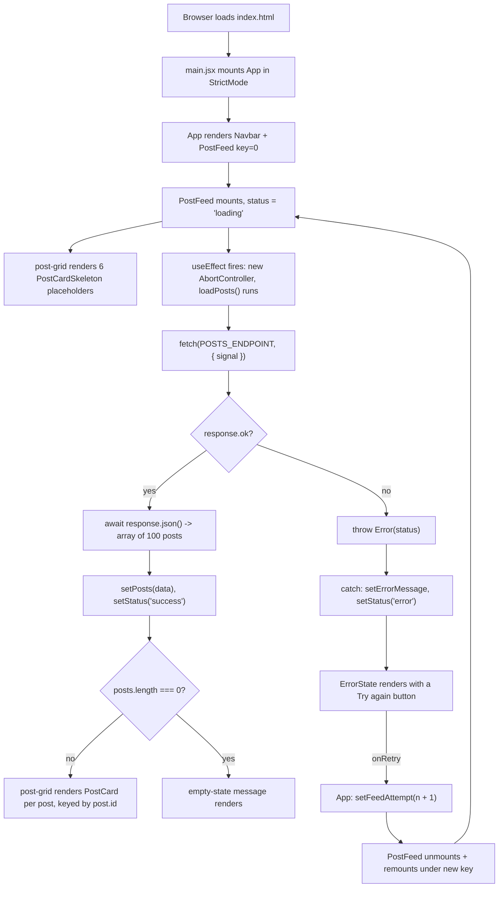

# Lecture 113 — Solution: Display the Cards

## Overview

This lecture is the **official solution walkthrough** for the exercise set in Lecture 111. The challenge: hit a real REST API — [JSONPlaceholder](https://jsonplaceholder.typicode.com/posts) — pull down 100 blog posts, and render **every single one of them as a card** inside a container on the page.

This version is a **premium redesign** of that original solution. The React data-fetching logic has been rebuilt to be genuinely production-shaped — tri-state (`loading` / `success` / `error`), `try/catch` around the network call, `AbortController` cleanup, and a real retry path — and the visual design has been reimagined from a bare `border: 2px solid black` flexbox list into a full editorial "newsroom dispatch" system: a two-tier masthead, a responsive CSS Grid of cards with per-author accent colors, a shimmering loading skeleton, and a "Stop Press" error state. No CSS framework was added — everything below is plain CSS, so `npm install` behaves exactly as it always did.

It still forces the same four core React skills to work together:

| Skill | Where it shows up |
|---|---|
| **State** (`useState`) | Holding fetched posts, load status, and error text |
| **Side effects** (`useEffect`) | Running the fetch once per mount, with proper cleanup |
| **Async data fetching** (`fetch` + `async/await` + `try/catch`) | Talking to the JSONPlaceholder API and handling failure |
| **List rendering** (`.map()` + `key`) | Turning an array of 100 objects into 100 cards |

It also reinforces **component composition** — the page is assembled from `Navbar`, `PostFeed`, `PostCard`, `PostCardSkeleton`, and `ErrorState` — and a small `utils/postDisplay.js` module of pure display-formatting helpers.

---

## The Challenge

Here is the original assignment, exactly as it was given:

> You have to use an api and display the data in the form of a card under a container. All the data points returned by the API should be converted to a card
> Use this API: https://jsonplaceholder.typicode.com/posts
>
> Hint:
> Create a state for the data which will be fetched using the Json Placeholder API
> Inside useEffect, use fetch to populate that state and then use map to render the cards from that state

The hint literally spells out the three-step recipe this solution follows:

1. **State** for the data.
2. **`useEffect` + `fetch`** to populate that state.
3. **`.map()`** to render a card per item.

This redesign follows that same recipe — it just also handles the two states the original hint left implicit: *what shows before the data arrives*, and *what shows if the fetch fails*.

---

## Project Structure

```
Lec-113 Solution Display the cards/
├── index.html                      # Single HTML page with the #root div
├── package.json                    # Vite + React 18 project manifest
├── .eslintrc.cjs                   # ESLint config (react/prop-types off — plain JS, no PropTypes dep)
├── Readme.md                       # These notes (originally: the assignment text)
└── src/
    ├── main.jsx                    # Entry point — mounts <App /> into #root
    ├── App.jsx                     # Page shell: Navbar + retry-key + <PostFeed />
    ├── App.css                     # Page layout, post grid, card, skeleton, error-state styles
    ├── index.css                   # Design tokens, reset, base typography, masthead/navbar styles
    ├── utils/
    │   └── postDisplay.js          # Pure helpers: author accent color, dispatch number, reading time
    └── components/
        ├── Navbar.jsx              # Two-tier "newspaper masthead" — brand + date + nav
        ├── PostFeed.jsx            # ⭐ Owns fetch/loading/error/success state for the grid
        ├── PostCard.jsx            # One post rendered as a "dispatch" card
        ├── PostCardSkeleton.jsx    # Shimmering placeholder shown while loading
        └── ErrorState.jsx          # "Stop Press" failure banner with a retry button
```

> `App.jsx` still imports `./App.css`, but it is no longer empty — it now holds the page layout, the post grid, and every card/skeleton/error style. Global tokens, the reset, and the masthead live in `src/index.css`, imported once in `main.jsx` so they apply everywhere.

---

## Concept Deep-Dives

### 1. The `useState` + `useEffect` + `fetch` pattern — now tri-state

All the fetch logic now lives in `src/components/PostFeed.jsx`, verbatim:

```jsx
const [posts, setPosts] = useState([])
const [status, setStatus] = useState('loading') // 'loading' | 'success' | 'error'
const [errorMessage, setErrorMessage] = useState('')

useEffect(() => {
  const controller = new AbortController()

  async function loadPosts() {
    try {
      const response = await fetch(POSTS_ENDPOINT, { signal: controller.signal })

      if (!response.ok) {
        throw new Error(`The server responded with status ${response.status}.`)
      }

      const fetchedPosts = await response.json()
      setPosts(fetchedPosts)
      setStatus('success')
    } catch (error) {
      if (error.name === 'AbortError') return

      setErrorMessage(error.message || 'Something went wrong while fetching dispatches.')
      setStatus('error')
    }
  }

  loadPosts()

  return () => controller.abort()
}, [])
```

Why each piece exists:

- **`useState([])` for `posts`** — starts empty so `.map()` is always safe, exactly as before.
- **`useState('loading')` for `status`** — this is the fix for the biggest gap in the original: the UI now has an explicit state machine (`loading` → `success` **or** `error`) instead of silently showing an empty container until data shows up.
- **`async function loadPosts()` declared *inside* the effect** — the effect callback itself still can't be `async` (see below), but now the helper function lives directly inside `useEffect`, not beside it, so there's no risk of it being called from anywhere else or capturing stale state.
- **`try/catch`** — a real network failure (offline, DNS failure, non-2xx status) now sets `status` to `'error'` and stores a human-readable message instead of leaving the app in an infinite loading state or throwing an unhandled rejection into the console.
- **`response.ok` check** — `fetch` only rejects on network-level failures; a `404` or `500` still resolves successfully, so the code explicitly checks `response.ok` and throws to route those into the same `catch` block.
- **`AbortController`** — the effect creates a controller, passes `controller.signal` into `fetch`, and returns a cleanup function that calls `controller.abort()`. This is what makes the double-fetch from `<React.StrictMode>` (see below) harmless instead of a source of "setting state on an unmounted component" bugs.
- **`setPosts(data)` / `setStatus('success')`** — the moment the UI comes alive, same as before.
- **No `console.log`** — the debug log from the original has been removed entirely; nothing is logged to the console in normal operation.

Each fetched post still looks like:

```json
{
  "userId": 1,
  "id": 1,
  "title": "sunt aut facere repellat provident occaecati excepturi optio reprehenderit",
  "body": "quia et suscipit\nsuscipit recusandae consequuntur expedita et cum\n..."
}
```

### 2. Why an `async` function *inside* `useEffect`?

Same underlying rule as before: `useEffect(async () => { ... }, [])` is illegal, because React expects the effect callback to return either nothing or a cleanup function, and an `async` function always returns a `Promise`. This solution now takes the tighter-scoped variant the original README predicted: `loadPosts` is declared **inside** the effect body and invoked synchronously at the bottom, right before the cleanup function is returned:

```jsx
useEffect(() => {
  const controller = new AbortController()

  async function loadPosts() { /* ... */ }

  loadPosts()

  return () => controller.abort()
}, [])
```

### 3. Handling `<React.StrictMode>`'s double-invoke gracefully

`main.jsx` still wraps `<App />` in `<React.StrictMode>`, which in development mounts, unmounts, and re-mounts every component once to surface effect bugs. Concretely, for `PostFeed`:

1. Effect runs → `AbortController` #1 created → `loadPosts()` starts a fetch.
2. React immediately "un-mounts" the dev-only extra copy → cleanup runs → `controller.abort()` cancels that fetch.
3. The aborted `fetch` rejects with an error whose `.name` is `'AbortError'` — caught, and immediately returned from, **without** touching `status` or `errorMessage`.
4. Effect runs again → `AbortController` #2 → a fresh `loadPosts()` call completes normally and updates state once.

The result: one real network round trip's worth of state updates, no console warnings, no "Stop Press" flash before the real data arrives. This is the same double-invoke behavior called out in the original README — it's just now handled by the code instead of merely being explained away.

### 4. Retrying without breaking the `[]` dependency array

The empty dependency array on `PostFeed`'s effect means *"fetch once, when this component mounts"* — exactly the original contract. But the redesign also needs a **Try again** button for the error state, and the effect can't be re-triggered without changing its dependencies.

The fix lives in `src/App.jsx`:

```jsx
const [feedAttempt, setFeedAttempt] = useState(0)

const handleRetry = () => setFeedAttempt((previousAttempt) => previousAttempt + 1)

// ...
<PostFeed key={feedAttempt} onRetry={handleRetry} />
```

Giving `<PostFeed>` a `key` tied to `feedAttempt` means that clicking retry doesn't reach into `PostFeed`'s internals at all — it changes the `key`, React treats that as "this is a different component instance," **unmounts the old one and mounts a brand-new one**, and the brand-new instance runs its own `useEffect(..., [])` from scratch. `PostFeed` itself stays simple: it only ever fetches once per its own lifetime.

### 5. `.map()` with the `key` prop — now twice

Two `.map()` calls now carry stable keys instead of one:

```jsx
// PostFeed.jsx — the real cards
{posts.map((post) => (
  <PostCard key={post.id} post={post} />
))}

// PostFeed.jsx — the loading skeletons
{Array.from({ length: SKELETON_COUNT }, (_, index) => (
  <PostCardSkeleton key={index} />
))}

// Navbar.jsx — the nav links
{NAV_LINKS.map((label, index) => (
  <li key={label} className={index === 0 ? 'masthead__nav-item--active' : undefined}>
```

`post.id` remains the correct key for real data (unique, stable, from the API). The skeleton placeholders and the three static nav labels have no natural id, so an array index / the label string itself is used — acceptable *only* because those lists are static and never reordered, filtered, or have items inserted in the middle.

### 6. Component composition — five small components instead of one big one

`App.jsx` is now purely a **shell**: it renders `Navbar`, a small page heading, and `PostFeed`, and owns exactly one piece of state (the retry counter). All of the fetch/loading/error/render logic that used to live in `App.jsx` has moved into `PostFeed.jsx`, which in turn delegates individual card markup to `PostCard.jsx`, loading placeholders to `PostCardSkeleton.jsx`, and the failure UI to `ErrorState.jsx`. This mirrors the same lesson the original README taught with `Navbar` — small, single-purpose components — just applied one level deeper.

### 7. Pure display helpers — `src/utils/postDisplay.js`

Three small, dependency-free functions turn a raw post into what the card needs to show, kept out of the component so they're trivially testable:

```js
export function getAuthorAccent(userId) { /* userId -> one of 6 accent colors, deterministically */ }
export function formatDispatchNumber(id) { /* 42 -> "No. 0042" */ }
export function estimateReadingTime(body) { /* word count -> "1 min read" */ }
```

`getAuthorAccent` is what makes the colored bar on the left edge of every card and the small dot in its header consistent per author — the closest thing this API's data has to a real avatar.

### 8. The card styling approach — a design system in plain CSS

Still no CSS framework, no inline styles, no CSS Modules — just plain CSS, now organized as a small system instead of five loose rules:

- **`src/index.css`** — CSS custom properties for color, elevation, radius, and typography (`:root { --paper: ...; --ink-primary: ...; --accent: ...; }`), a modern reset, and the masthead/navbar styles.
- **`src/App.css`** — the page layout, the `.post-grid` (CSS Grid, not flexbox), the `.post-card` itself, the skeleton shimmer animation, and the `.error-state` banner.

The grid, verbatim:

```css
.post-grid {
  display: grid;
  grid-template-columns: repeat(auto-fit, minmax(300px, 1fr));
  gap: 28px;
}
```

`repeat(auto-fit, minmax(300px, 1fr))` is what makes the layout genuinely responsive: the browser fits as many 300px-minimum columns as will cleanly divide the available width, stretching them to fill any remainder, and reflows automatically — no media query needed to go from one column on mobile to four-plus on a wide desktop.

---

## Full Code Walkthrough

### `src/App.jsx`

```jsx
import { useState } from 'react'
import Navbar from './components/Navbar'
import PostFeed from './components/PostFeed'
import './App.css'

function App() {
  // Bumping this number gives <PostFeed> a new `key`, which forces React to
  // unmount the old instance and mount a brand-new one — a clean way to
  // "retry" a failed fetch without threading extra dependencies through
  // useEffect.
  const [feedAttempt, setFeedAttempt] = useState(0)

  const handleRetry = () => setFeedAttempt((previousAttempt) => previousAttempt + 1)

  return (
    <>
      <Navbar />
      <main className="page">
        <div className="page__intro">
          <h2 className="page__heading">Front Page</h2>
          <span className="page__count">jsonplaceholder.typicode.com/posts</span>
        </div>
        <PostFeed key={feedAttempt} onRetry={handleRetry} />
      </main>
    </>
  )
}

export default App
```

**Step 1 — Imports.** `useState` from React; `Navbar` and the new `PostFeed` from `./components`; `App.css` for the page's own styles.

**Heading hierarchy note.** `Navbar` renders the page's only `<h1>` (the masthead wordmark). `Front Page` here is an `<h2>` — the section heading for the grid below it — and each `PostCard`'s title is an `<h3>` nested under that section. `h1 → h2 → h3` with nothing skipped, per the Web Interface Guidelines' heading-hierarchy rule.

**Step 2 — Retry state.** `feedAttempt` starts at `0` and only ever increments. It exists purely to change `<PostFeed>`'s `key`.

**Step 3 — The render.** A fragment with `<Navbar />` on top, then a `<main className="page">` holding a small section heading and `<PostFeed>`. `App` itself never touches `fetch`, loading flags, or error text — that's `PostFeed`'s job.

### `src/components/PostFeed.jsx` — the whole fetch lifecycle

```jsx
import { useEffect, useState } from 'react'
import PostCard from './PostCard'
import PostCardSkeleton from './PostCardSkeleton'
import ErrorState from './ErrorState'

const POSTS_ENDPOINT = 'https://jsonplaceholder.typicode.com/posts'
const SKELETON_COUNT = 6

const PostFeed = ({ onRetry }) => {
  const [posts, setPosts] = useState([])
  const [status, setStatus] = useState('loading') // 'loading' | 'success' | 'error'
  const [errorMessage, setErrorMessage] = useState('')

  useEffect(() => {
    const controller = new AbortController()

    async function loadPosts() {
      try {
        const response = await fetch(POSTS_ENDPOINT, { signal: controller.signal })

        if (!response.ok) {
          throw new Error(`The server responded with status ${response.status}.`)
        }

        const fetchedPosts = await response.json()
        setPosts(fetchedPosts)
        setStatus('success')
      } catch (error) {
        // In StrictMode's dev-only double-invoke, the first effect's cleanup
        // aborts its own in-flight request — that rejection lands here as an
        // AbortError and is expected, not a real failure, so it's ignored.
        if (error.name === 'AbortError') return

        setErrorMessage(error.message || 'Something went wrong while fetching dispatches.')
        setStatus('error')
      }
    }

    loadPosts()

    return () => controller.abort()
  }, [])

  if (status === 'loading') {
    return (
      <div className="post-grid" aria-busy="true" aria-live="polite">
        {Array.from({ length: SKELETON_COUNT }, (_, index) => (
          <PostCardSkeleton key={index} />
        ))}
      </div>
    )
  }

  if (status === 'error') {
    return <ErrorState message={errorMessage} onRetry={onRetry} />
  }

  if (posts.length === 0) {
    return (
      <p className="empty-state">No dispatches came back from the wire this time.</p>
    )
  }

  return (
    <div className="post-grid">
      {posts.map((post) => (
        <PostCard key={post.id} post={post} />
      ))}
    </div>
  )
}

export default PostFeed
```

**Step 1 — State.** `posts` (the data), `status` (the three-way state machine), `errorMessage` (only meaningful when `status === 'error'`).

**Step 2 — The effect.** Runs once per mount. Creates an `AbortController`, defines `loadPosts` inside the effect, calls it, and returns a cleanup that aborts the request — the mechanism that makes StrictMode's double-invoke and any real unmount-mid-fetch both safe.

**Step 3 — Four-way render.** `status === 'loading'` renders a grid of `PostCardSkeleton`s; `status === 'error'` renders `ErrorState`; a successful-but-empty response renders a small `.empty-state` message instead of a silently blank grid; otherwise the real `post-grid` of `PostCard`s renders.

### `src/components/PostCard.jsx`

```jsx
import { estimateReadingTime, formatDispatchNumber, getAuthorAccent } from '../utils/postDisplay'

const PostCard = ({ post }) => {
  const accentColor = getAuthorAccent(post.userId)

  return (
    <article className="post-card" style={{ '--accent-color': accentColor }}>
      <header className="post-card__header">
        <span className="post-card__author-dot" aria-hidden="true" />
        <span className="post-card__number">{formatDispatchNumber(post.id)}</span>
      </header>

      <h3 className="post-card__title">{post.title}</h3>
      <p className="post-card__body">{post.body}</p>

      <footer className="post-card__footer">
        <span>Filed by Contributor #{post.userId}</span>
        <span>{estimateReadingTime(post.body)}</span>
      </footer>
    </article>
  )
}

export default PostCard
```

Each card sets a CSS custom property, `--accent-color`, directly via `style`, computed once per render from `getAuthorAccent(post.userId)`. `App.css` then reads that variable for both the left accent bar (`.post-card::before`) and the header dot (`.post-card__author-dot`), so the two stay in sync automatically.

### `src/components/PostCardSkeleton.jsx`

```jsx
const PostCardSkeleton = () => (
  <div className="post-card post-card--skeleton" aria-hidden="true">
    <div className="skeleton-line skeleton-line--tag" />
    <div className="skeleton-line skeleton-line--title" />
    <div className="skeleton-line skeleton-line--title is-short" />
    <div className="skeleton-line skeleton-line--body" />
    <div className="skeleton-line skeleton-line--body" />
    <div className="skeleton-line skeleton-line--body is-short" />
    <div className="skeleton-line skeleton-line--footer" />
  </div>
)

export default PostCardSkeleton
```

Reuses the `.post-card` class so the skeleton's size and spacing match a real card exactly (no layout jump when data arrives), then layers on a shimmering `linear-gradient` animation defined in `App.css`. `aria-hidden="true"` keeps this purely-decorative placeholder out of the accessibility tree.

### `src/components/ErrorState.jsx`

```jsx
// Visible, actionable failure state for the feed. `role="alert"` means
// screen readers announce it as soon as it mounts, and the retry button
// hands control straight back to the person reading it.
const ErrorState = ({ message, onRetry }) => (
  <div className="error-state" role="alert">
    <p className="error-state__label">Stop Press</p>
    <h3 className="error-state__title">Your Dispatches Didn’t Load</h3>
    <p className="error-state__message">{message}</p>
    <button type="button" className="error-state__retry" onClick={onRetry}>
      Try Again
    </button>
  </div>
)

export default ErrorState
```

`role="alert"` makes assistive technology announce this the moment it mounts. `message` is the real `error.message` captured in `PostFeed`'s `catch` block — not a generic string — so a broken-URL test (see Common Pitfalls) shows a genuinely different message than a `500` from the server.

### `src/utils/postDisplay.js`

```js
const AUTHOR_ACCENTS = [
  '#b1462b', // brick red
  '#c08a28', // ochre
  '#2f6f6b', // teal
  '#3c4a7a', // indigo
  '#6b7a3a', // olive
  '#7a3c5e', // plum
]

const WORDS_PER_MINUTE = 200

export function getAuthorAccent(userId) {
  const numericId = Number(userId)
  const safeId = Number.isFinite(numericId) ? Math.abs(numericId) : 0
  return AUTHOR_ACCENTS[safeId % AUTHOR_ACCENTS.length]
}

export function formatDispatchNumber(id) {
  return `No. ${String(id).padStart(4, '0')}`
}

export function estimateReadingTime(body) {
  const wordCount = body.trim().split(/\s+/).filter(Boolean).length
  const minutes = Math.max(1, Math.round(wordCount / WORDS_PER_MINUTE))
  return `${minutes} min read`
}
```

Three pure functions, zero React imports — they take primitives in and return primitives out, which is what makes them easy to reuse (or unit-test, see Extension Exercises) independent of any component.

### `src/components/Navbar.jsx`

```jsx
const NAV_LINKS = ['Home', 'About', 'Contact Us']

const DATE_FORMATTER = new Intl.DateTimeFormat('en-US', {
  weekday: 'long',
  month: 'long',
  day: 'numeric',
  year: 'numeric',
})

const Navbar = () => {
  const today = DATE_FORMATTER.format(new Date())

  return (
    <header className="masthead">
      <div className="masthead__top">
        <div>
          <p className="masthead__eyebrow">Vol. 1 · Live Feed</p>
          <h1 className="masthead__title">The Placeholder Dispatch</h1>
          <p className="masthead__tagline">Bulletins fetched fresh from JSONPlaceholder</p>
        </div>
        <div className="masthead__meta">
          <span className="masthead__date">{today}</span>
        </div>
      </div>

      <nav className="masthead__nav" aria-label="Primary">
        <ul className="masthead__nav-list">
          {NAV_LINKS.map((label, index) => (
            <li key={label} className={index === 0 ? 'masthead__nav-item--active' : undefined}>
              <button type="button" className="masthead__nav-link">
                {label}
              </button>
            </li>
          ))}
        </ul>
      </nav>
    </header>
  )
}

export default Navbar
```

Still a stateless, prop-free component — same spirit as the original — but now a two-tier masthead: a brand row (wordmark, tagline, today's date) and a nav row underneath, with the first link (`Home`) visually marked as the active page via `masthead__nav-item--active`. The links are `<button>` elements rather than bare `<li>` text so they're keyboard-focusable and screen-reader-actionable, even though they don't navigate anywhere yet.

### `src/main.jsx` — the entry point (unchanged)

```jsx
import React from 'react'
import ReactDOM from 'react-dom/client'
import App from './App.jsx'
import './index.css'

ReactDOM.createRoot(document.getElementById('root')).render(
  <React.StrictMode>
    <App />
  </React.StrictMode>,
)
```

Untouched by this redesign: it still mounts `<App />` into `#root` inside `<React.StrictMode>`, and still imports `index.css` globally. StrictMode's dev-only double-invoke of effects is exactly what `PostFeed`'s `AbortController` cleanup was built to absorb gracefully (see Concept Deep-Dive #3).

### `index.html`

```html
<!doctype html>
<html lang="en">
  <head>
    <meta charset="UTF-8" />
    <link rel="icon" type="image/svg+xml" href="/vite.svg" />
    <meta name="viewport" content="width=device-width, initial-scale=1.0" />
    <meta name="theme-color" content="#f4eee0" />
    <link rel="preconnect" href="https://jsonplaceholder.typicode.com" />
    <title>The Placeholder Dispatch</title>
  </head>
  <body>
    <div id="root"></div>
    <script type="module" src="/src/main.jsx"></script>
  </body>
</html>
```

Same Vite shell as before, with three additions: the browser tab `<title>` updated from the generic "Vite + React" to match the app's identity, a `<meta name="theme-color">` matching the `--paper` background so mobile browser chrome matches the page, and a `<link rel="preconnect">` to the JSONPlaceholder origin so the DNS/TLS handshake for the fetch in `PostFeed` starts warming up before React even mounts.

---

## How It All Fits Together — The Data Flow



In words:

1. **Mount** — the browser loads `index.html`; `main.jsx` mounts `<App />` into `#root`.
2. **Shell renders instantly** — `App` renders `Navbar` and hands off to `PostFeed`, which starts in `status = 'loading'`.
3. **Skeleton, not a blank page** — while `status === 'loading'`, six shimmering `PostCardSkeleton`s fill the grid, so the layout never looks broken or empty.
4. **Effect fires** — after that first render commits, `PostFeed`'s `useEffect` creates an `AbortController` and calls `loadPosts()`.
5. **Fetch** — the browser requests `https://jsonplaceholder.typicode.com/posts`; on success the response is parsed into an array of 100 objects.
6. **State update** — `setPosts(data)` and `setStatus('success')` fire together; React schedules a re-render.
7. **Cards on screen** — `post-grid` (CSS Grid, `auto-fit`/`minmax`) lays out one `PostCard` per post, each colored by its author via `getAuthorAccent`.
8. **On failure** — a non-2xx status or a network error is caught, `status` becomes `'error'`, and `ErrorState` renders with the real error message and a **Try again** button.
9. **Retry** — clicking that button calls `App`'s `handleRetry`, which increments `feedAttempt`; the changed `key` makes React remount `PostFeed` from scratch, restarting the whole flow at step 3.

The key mental model is unchanged from the original: **UI = f(state)**. You never manually add cards, skeletons, or error banners to the page — you update *state*, and React recomputes the UI from it.

---

## How to Run

```bash
# 1. Install dependencies (React 18, Vite 5, ESLint) — no new packages were added
npm install

# 2. Start the dev server
npm run dev
```

Vite prints a local URL (typically `http://localhost:5173`). Open it and you'll see the masthead and a shimmering skeleton grid for a moment, then the 100 dispatch cards fade in.

Other scripts from `package.json`: `npm run build` (production bundle), `npm run preview` (serve that bundle), `npm run lint` (ESLint check — passes clean with `--max-warnings 0`).

> **No new dependencies were added.** This redesign is plain CSS (custom properties, Grid, keyframe animations) — there is no Tailwind or component library to wire up, so the existing `package.json` and `npm install` step are unchanged.

---

## Key Takeaways

1. **Data fetching in React is a three-beat rhythm, plus two states you can't skip**: state to hold it, an effect to fetch it, `.map()` to render it — and explicit `loading`/`error` states so the UI never lies about what's actually happening.
2. **Initialize list state as `[]`, not `null`** — the first render happens *before* the data arrives, and `[].map()` is safe while `null.map()` crashes.
3. **`useEffect(fn, [])` runs after the first render only** — but a component can still be "retried" cleanly by changing its `key` from the parent, forcing a full remount instead of fighting the dependency array.
4. **The effect callback can't be `async`** — define the async work as a named function *inside* the effect and call it synchronously.
5. **`AbortController` turns StrictMode's double-invoke (and real unmounts) from a landmine into a non-event** — abort in the cleanup function, ignore `AbortError` in the `catch`.
6. **Every mapped element needs a stable `key`** — real IDs from data (`post.id`) for real data; index/label only for lists that are static and never reordered.
7. **Composition scales** — what was one component with fetch + render mixed together is now five small, single-purpose components (`Navbar`, `PostFeed`, `PostCard`, `PostCardSkeleton`, `ErrorState`) plus a pure-function utils module.
8. **CSS Grid's `repeat(auto-fit, minmax(...))`** is a genuinely responsive card grid with zero media queries for the column count.
9. **Heading levels aren't decoration.** `Navbar`'s `<h1>` → the grid's `<h2>` ("Front Page") → each card's `<h3>` forms one unbroken outline; screen-reader users can jump by heading level and it will make sense.
10. **A "successful but empty" response is still a state you have to design for.** `PostFeed` explicitly checks `posts.length === 0` after a successful fetch so an empty API response renders a message instead of a blank grid that looks broken.

## Common Pitfalls

- **The infinite fetch loop.** Forget the `[]` and write `useEffect(() => { loadPosts() })` — now the effect runs after *every* render, and since `setStatus`/`setPosts` trigger a render, you get: fetch → setState → render → effect → fetch → ... forever, hammering the API. The empty dependency array is not optional decoration; it is the brake.
- **Calling a setter directly in the component body.** A state update during render causes an immediate re-render, giving you the classic "Too many re-renders" error. Side effects go in `useEffect`, full stop.
- **Missing `key` prop.** The app still works, but React warns `Each child in a list should have a unique "key" prop` and list updates become slower and potentially buggy. Use `key={post.id}` as this solution does — avoid `key={index}` whenever the data has real IDs.
- **Forgetting `await response.json()`.** `fetch` resolves to a `Response`, not data. Skip the `.json()` step (or its `await`) and you'll be setting a Promise/Response into state and mapping over garbage.
- **Forgetting `response.ok`.** `fetch`'s promise only rejects on network-level failure — a `404` or `500` still resolves "successfully." Without an explicit `if (!response.ok) throw ...`, a broken endpoint silently renders an empty grid instead of the error state.
- **Setting state after unmount.** Without the `AbortController` cleanup, a slow request that resolves after the component has unmounted (or after StrictMode's dev-only extra mount/unmount cycle) will call `setPosts`/`setStatus` on a component that's gone, logging a React warning. Cancel the request in the effect's cleanup function instead.
- **A note on CORS.** This exercise "just works" because JSONPlaceholder sends the `Access-Control-Allow-Origin: *` header, explicitly permitting requests from any origin. Many real APIs do **not** — a browser `fetch` from `localhost:5173` to such an API fails with a CORS error in the console. That's a server-side policy, not a bug in your code; solutions include a backend proxy or the API enabling CORS.
- **Seeing the skeleton flash twice (or not at all) in dev?** That's `<React.StrictMode>` deliberately double-invoking effects in development to surface cleanup bugs — the first request gets aborted almost immediately, so you'll typically only notice the skeleton once. Production runs the effect a single time.

## Extension Exercises

1. **Loading and error states.** ~~Add `loading` and `error` state~~ — done in this redesign. Next step: add a **timeout** (e.g. `AbortController` + `setTimeout`) so a hung request surfaces `ErrorState` instead of spinning forever.
2. **Search filter.** Add a controlled `<input>` above the grid and filter posts by title with `posts.filter(...)` before mapping in `PostFeed` — live search with zero extra libraries.
3. **Unit test the utils.** `src/utils/postDisplay.js` is pure functions with no React dependency — a natural first target for `vitest`: assert `formatDispatchNumber(7)` returns `"No. 0007"`, and that `getAuthorAccent` is deterministic for the same `userId`.
4. **Delete button per card.** Add a button to `PostCard` that calls back up to `PostFeed` to remove a post from state: `setPosts((current) => current.filter((post) => post.id !== id))` — your first taste of immutable state updates on lists.
5. **Second endpoint.** Fetch `https://jsonplaceholder.typicode.com/users` too, and show each post's real author name in the footer instead of `Contributor #{userId}`, by matching `post.userId` to `user.id`.
6. **Pagination or infinite scroll.** JSONPlaceholder returns all 100 posts at once; slice them client-side (e.g. 12 per "page") and add a **Load more** button or an `IntersectionObserver` to fetch the next slice into view.
7. **Virtualize the grid.** This redesign intentionally renders all 100 `PostCard`s directly — simple and plenty fast for 100 lightweight text cards, but the Web Interface Guidelines recommend virtualizing lists over ~50 items. Try swapping `.post-grid` for `react-window` or `@tanstack/react-virtual` (this would be the first *required* `npm install` in the project) and compare scroll performance with 500+ mock posts.
